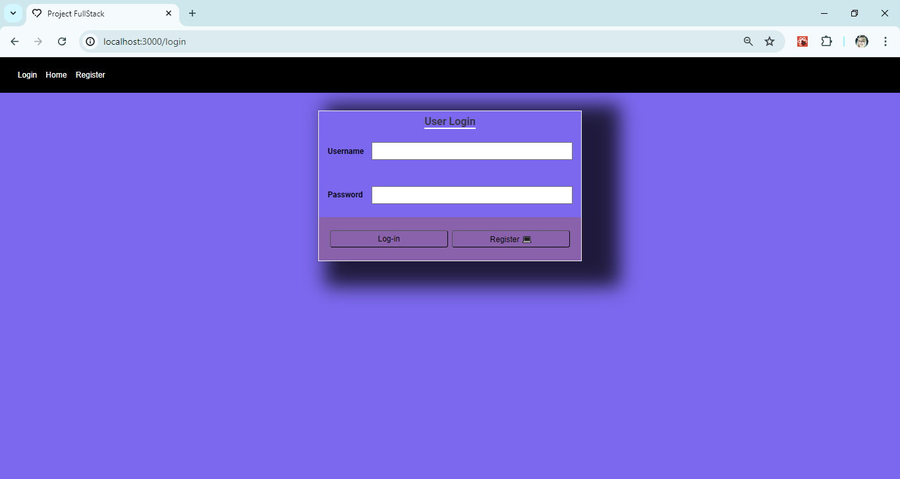

<h2 align="center"> 💻 FullStack project using Node.js, React.js and Mongo_BD</h2>

<h3 align="center"> Starting from BackEnd 🥰😍😍😍 </h3>

<h3 align="center"></h3>


  <h4 align="center"> Starting Mongo_BD</h4>
  <div align="center">
     </div>
    
   <h4 align="center"> All_users Insomnia </h4>
     <div align="center">
         </div>
    
   <h4 align="center"> All_users Insomnia </h4>
     <div align="center">
     </div>
       
   <h4 align="center"> User Insomnia </h4>
     <div align="center">
      </div>
     <h4 align="center"> User_VSCode </h4>   <div align="center">
     </div>
       <h4 align="center"> User_token Insomnia </h4>
      <div align="center">
         </div>


# Index

- [Sobre](#- About)
- [Technologies used](#- Technologies-used)
- [How to use](#-How-to-use)

## 🔖 About

The project **-Starting from Scratch** was developed to show the development of an application using NodeJS, starting from scratch.
## 🚀 Technologies used

- [Express](http://expressjs.com/en/5x/api.html#app.use)
- [Jsonwebtoken](https://github.com/auth0/node-jsonwebtoken#readme)
- [Mongoose](https://mongoosejs.com/docs/guide.html)

## 🤔 How to use

```bash
    yarn install

    yarn dev
```

<h3 align="center"> Starting from FrontEnd 🥰😍😍😍 </h3>

  <h4 align="center"> Starting Login User</h4>
   <div align="center">
      </div>
   <h4 align="center"> Register User </h4>
      <div align="center">
      </div>
       

<p align="center">🎉
  <a href="#-sobre"> About </a>&nbsp;&nbsp;&nbsp;|&nbsp;&nbsp;&nbsp;
  <a href="#-conceitos-ensinados">Conceitos ensinados</a>&nbsp;&nbsp;&nbsp;|&nbsp;&nbsp;&nbsp;
  <a href="#-material-de-apoio">Material de apoio</a>&nbsp;&nbsp;&nbsp;|&nbsp;&nbsp;&nbsp;
    <a href="#-como-baixar">Como baixar</a>
</p>

# 🔖 About

This project was created as part of the development of a user login tutorial, teaching how to develop a Frontend and Backend application.

## ✍🏻 Concepts taught

During development, concepts such as Hooks were taught, within ReactJS, how to create a component, styling using CSS concepts, among others.

## 🗂 Support material

- [Create React App](https://github.com/facebook/create-react-app)
- [ReactJS](https://pt-br.reactjs.org/)
- [React Router DOM](https://reacttraining.com/react-router/web/api/Hooks/usehistory)
- [FlexBox](https://origamid.com/projetos/flexbox-guia-completo/)
- [Fontes Google](https://fonts.google.com/)
- [Table Html concepts](https://www.w3schools.com/tags/tag_th.asp)

## 👍🏻 How to download

```bash

    // Clone repository
    $ git clone https://github.com/ludiemert/FullStack_Node_React_Mongo.git

    // Access directory
    $ cd FullStack_Node_React_Mongo

    // Install dependencies
    $ yarn

    // Start project
    $ yarn start
```

---
<h3>Desenvolvido 💜 por Luciana Diemert using the Rocketseat platform's library </h3>

 [](https://www.linkedin.com/in/lucianadiemert/)

#### Contact


#### [**Luciana Diemert**](https://github.com/ludiemert)

🛠 `Front-end` `Back-end`Developer Jr. <br>
📍 São Jose dos Campos – SP - Brazil

<a href="https://www.linkedin.com/in/lucianadiemert" target="_blank"></a>&nbsp;
<a href="mailto:lucianadiemert@gmail.com" target="_blank"></a>&nbsp;
<a href="#"></a>&nbsp;
<a href="https://www.github.com/ludiemert" target="_blank"></a>&nbsp;

<br clear="left"/>


